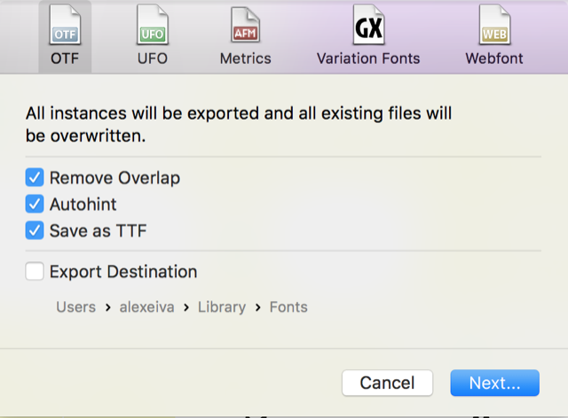

### Source Files

There are 2 source files, one for Romans and one of Italics, in the [GlyphsApp](https://www.glyphsapp.com/) format:

* [/sources/Merriweather.glyphs](../master/sources/Merriweather.glyphs)
* [/sources/Merriweather-Italic.glyphs](../master/sources/Merriweather-Italic.glyphs)

GlyphsApp is required for generating font files from these sources. At the moment there is no headless version of GlyphsApp to export fonts using a script shell. Stay tuned to this [thread](https://forum.glyphsapp.com/t/how-to-automate-glyphs-export/4800/11) for updates.

When exporting TTF font files from GlyphsApp checking [x] Autohint option is recommended

